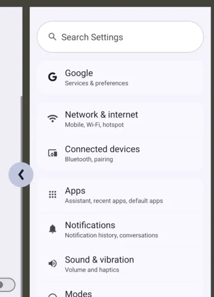
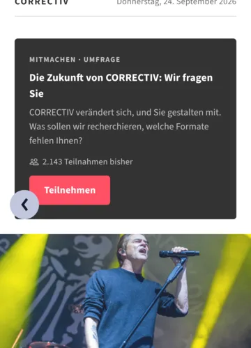

# ADR 0063 — Android back is the navigator's, and the onboarding answers its own

Status: accepted, 2026-09-24, and built in the same pull request. It answers
[#120](https://github.com/correctiv/correctiv-app/issues/120), and the open item that
[ADR 0026](0026-react-native-review-and-hardening.md) §9 and
[ADR 0030](0030-the-platforms-header-and-ours-on-web.md) left about the native arrow.

## Context

Until now nothing in the app touched Android's back. There was no `BackHandler`,
`lib/navigation/goBack.ts` sat under the drawn back control only, and `app.json` carried
`predictiveBackGestureEnabled: false`. #120 called that a set of defaults rather than a
decision, and listed the cases where a default could be wrong.

Each case was walked on `Medium_Phone_API_36` (Android 16, the app targeting SDK 36) from
a release build, with the button (`input keyevent 4`) and with the gesture (a swipe from
the left edge), on 2026-09-24. The web export was walked in headless Chrome the same day,
with `history.back()`.

| Case | Before this record | After |
| --- | --- | --- |
| `correctiv://gespeichert` from a cold start | back → Home → the launcher | unchanged |
| a deep link fired with `NEW_TASK \| CLEAR_TASK`, as a notification's would be, cold and warm | back → Home → the launcher | unchanged |
| a tab entered by deep link, and a tab switched to | back → Home | unchanged |
| the native arrow on a route entered cold | → Home | unchanged |
| `player`, the modal | back closes it | unchanged |
| `/video`, which is a pushed route now and not an overlay | back pops it; playback stops (`dumpsys audio`) | unchanged |
| the onboarding opened over the app, second page | back closed the **whole flow** | back goes to the first page |
| the onboarding on a **first launch**, any page | back **left the app**, and the next start opened the same page | back steps through the pages, then out of the first page into Home, recorded as done |
| the door, signed out, and a deep link while signed out | back leaves the app | unchanged, and now written down |
| web: a pushed route, a tab, the player | browser back returns | unchanged |
| web: a route opened in a new tab | browser back has nothing; the drawn control goes Home | unchanged |
| web: the onboarding | browser back does not step through its pages | unchanged |

Two things in that table were wrong, both on the onboarding, and both because its three
pages are one screen with a counter. The navigator cannot see them, so it answered back by
popping the screen. On a first launch the root layout reaches the onboarding with
`router.replace` from `/`, which leaves the onboarding as the only screen on the stack,
and popping the only screen is leaving the app. A reader who had just signed in was put
out on the launcher.

The rest held because of `unstable_settings.anchor = '(tabs)'`: every route entered
directly had the tabs under it, from the button, the gesture and the native arrow alike.
That is the answer to the open item of ADR 0026 §9 and ADR 0030: the native arrow did
not reach a dead end the anchor does not cover, on any route this walk entered cold.
`goBack` stays, for the reason ADR 0030 already gave: the web target's drawn bar uses it.

## Decision

### 1. The navigator answers back, and a screen answers only for what is not a route

No screen intercepts back to do what the navigator already does. The one that does is the
onboarding, whose pages are not routes: back goes to the page before, and out of the first
page it does what the page's skip does, which records the onboarding as done and goes to
Home. When the onboarding was opened over the app, back from the first page is left to the
navigator, which pops it.

Out of the first page on a first launch, three other answers were possible and each was
worse. Staying would make the first screen a new reader sees the one screen they cannot
back out of. Leaving the app is what #120 rules out. Going Home without recording it would
ask again on every start, which is the skip's own reason for recording it. The mission page
has no skip button, and back is how Android spells one.

The decision is `onboardingBack` in `packages/app-core/src/lib/back.ts`, a function of the
page and of whether the navigator has a screen underneath. Listening is the host's:
`apps/mobile/src/lib/navigation/useSystemBack.ts` wraps React Native's `BackHandler`. No
port was declared, because the core does not listen for back and needs nothing from the
platform to decide it.

### 2. Predictive back stays off, because turned on it draws nothing

`predictiveBackGestureEnabled: false` stays, and `app.config.js` carries the reason beside
the value, because `app.json` cannot.

React Native 0.86's `ReactActivity` registers an `OnBackPressedCallback` on apps targeting
SDK 36 and keeps it enabled for as long as the activity lives, so that `BackHandler` still
hears back. Android previews the screen behind a back gesture only when no callback is
enabled. So the preview cannot appear, and that was measured rather than read: with the flag
turned on in the generated manifest, a back gesture held half way showed the system's arrow
and no preview, on Home and on a pushed route. The system's Settings app, under the same
injected gesture on the same emulator, showed its preview.

Turning it on would change which path every back takes, for nothing a reader sees. What
would be needed first is the callback enabled only while a screen has something to pop,
which is React Native's to change and not this app's. When it is on, the one interceptor
here is already on the callback path: `BackHandler` is fed by that callback, and the
onboarding's back was walked with the flag on and stepped through its pages as it does
with it off.

### 3. Back on the door leaves the app

While the session is not admitted the root layout renders the gate instead of the
navigator, so there is no stack and nothing answers back, and the system closes the app.
That is kept. Behind the door there is nothing a signed-out reader may see, so there is
nowhere for back to go, and a back that did nothing would make the door the one screen a
reader cannot leave the usual way. The comment on the gate in `app/_layout.tsx` says so, so
that it is not "fixed" later as an oversight.

### 4. On the web, browser back is the browser's

The web target answers nothing: `useSystemBack.web.ts` registers no listener. Browser back
walks the browser's history, and that history is already right for routes, tabs and the
player. It does not step through the onboarding's pages, because they are one address.
Writing a history entry per page was not done: it would put three entries for one address
into a reader's history, and a reload on the second page would open the first. React Native
Web's `BackHandler` exists, and logs an error for every listener, which the workbench's
render checks count as a fault.

## What this does not decide

- **iOS.** It has no system back button; the edge swipe belongs to the native stack and
  was not walked. The onboarding's `useSystemBack` does nothing there.
- **The video's fullscreen.** expo-video's native fullscreen was not reached in the walk,
  so whether back leaves it first is read off the player, not measured.
- **A real notification.** The app has no notification library yet, so the tap was
  simulated with the intent flags a notification's `PendingIntent` would carry. When one
  arrives, its tap is the case to walk again.

## What it retires

Nothing is struck. The open item of ADR 0026 §9 and ADR 0030's "was not settled" were true
when written and are answered here rather than voided.
